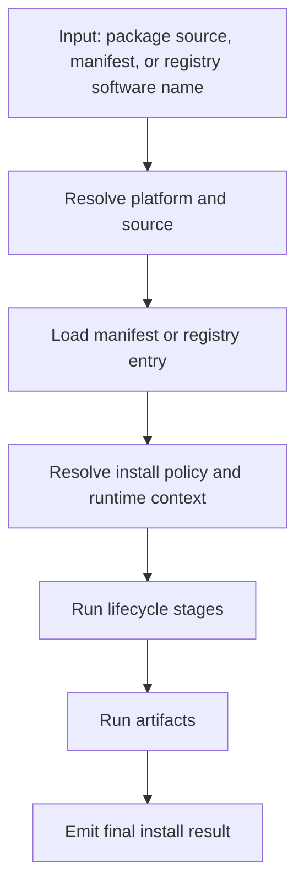

> Migrated from `docs/guide/architecture.md` on 2026-06-24.
> Owner: SDKWork maintainers

# Architecture

`hub-installer` is built around one shared install pipeline that can be driven from either the Node.js or Rust surface.

## The Core Flow

## Layers

### 1. Request Resolution

This layer answers:

- are we installing directly from a package source, from a manifest, or from a registry entry,
- which platform is targeted,
- which package format applies,
- whether a remote file or registry needs to be downloaded first.

In Node.js this starts from `InstallRequest`, manifest loaders, or registry services. In Rust it starts from `InstallEngine` plus `ApplyManifestOptions` or `RegistryInstallOptions`.

### 2. Manifest Model

The manifest model is the product center of gravity. It describes:

- lifecycle stages such as `preflight`, `install`, `postInstall`, and `healthcheck`,
- dependency checks and optional remediation,
- artifact types such as `package`, `git`, `huggingface`, and `command`,
- variables and runtime templates.

Reference:

- [Manifest Spec](/manifest-spec)

### 3. Registry Model

The registry maps human-friendly software names to manifests and default variables.

This is how flows such as `openclaw`, `nodejs`, `python`, and `codex` become productized without requiring users to select a raw manifest manually.

Reference:

- [Registry Spec](/registry-spec)

### 4. Install Policy

Install policy separates installer-owned state from software-owned layout:

- installer home
- install root
- work root
- bin directory
- data root
- install control level

Reference:

- [Install Policy](/install-policy)

### 5. Runtime Resolution

Runtime resolution is where the install engine becomes platform-aware.

Important distinctions:

- **host platform**: where the engine process is running,
- **effective runtime platform**: where commands should execute,
- **container runtime**: which Docker path should be validated and used.

This matters most for Windows plus WSL plus Docker combinations. The dedicated guide is here:

- [Runtime And Docker](/guide/runtime-and-docker)

## Node.js And Rust Responsibilities

| Capability | Node.js | Rust |
| --- | --- | --- |
| Package install planning and execution | Yes | Yes |
| Manifest apply | Yes | Yes |
| Registry install by software name | Yes | Yes |
| Built-in doctor flow | Yes | Not yet a dedicated CLI doctor command |
| Structured live observer events | No | Yes |
| Tauri backend embedding | Possible but indirect | First-class fit |

## Result Shapes

Both implementations preserve stable final result objects rather than forcing consumers to parse terminal text.

Typical result layers:

- plan summary,
- executed steps,
- duration and success metadata,
- stage and artifact reports,
- install policy outputs.

Rust adds a separate real-time event stream on top of the final result instead of replacing it.

## Why The Rust Observer Model Matters

The Rust design deliberately separates:

- semantic lifecycle events,
- command invocation events,
- stdout/stderr chunks,
- final structured results.

That separation makes it practical to build:

- terminal progress output,
- Tauri event streaming,
- persistent logging,
- analytics or telemetry later,

without changing installer logic.

